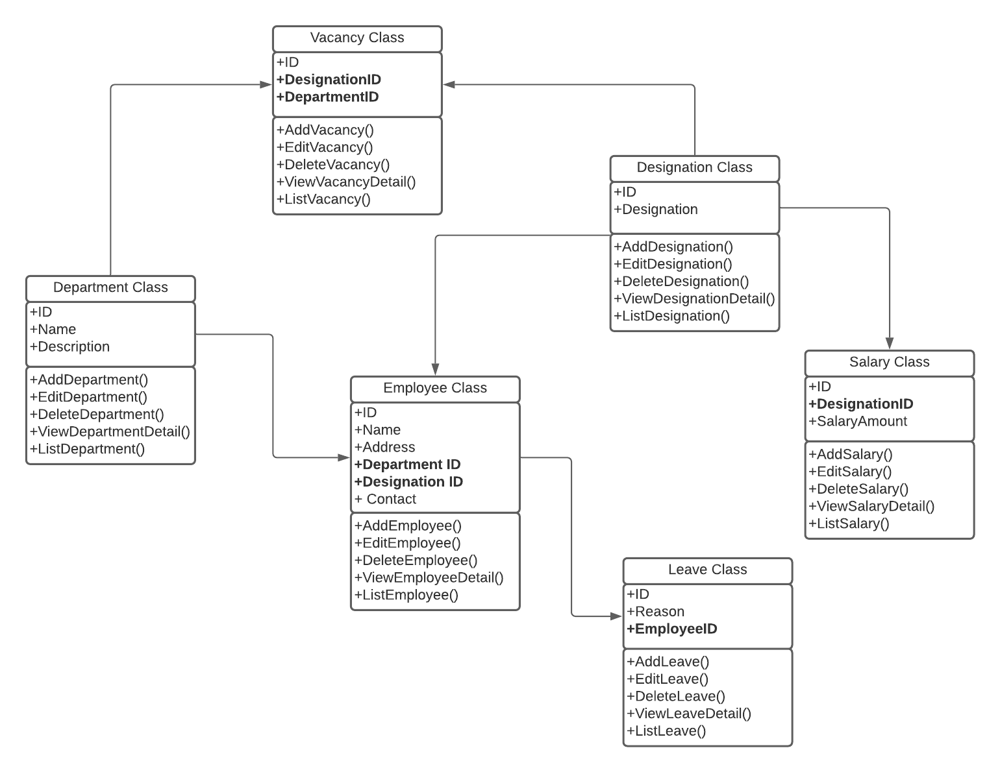

# Introduction

Employee management system class diagram describes the structure of a Employee management systems classes, their attributes, operations or methods and relationship among objects. The main classes of the Employee management system are Employee, Salary, Leave, Department, Designation and Vacancy.

# Classes of Employee management System

- Employee Class: Manage all the operations of Employee
- Salary Class: Manage all the operations of Salary
- Leave Class: Manage all the operations of Leave
- Department Class: Manage all the operations of Department
- Designation Class: Manage all operations of Designation
- Vacancy Class: Manage all operations of Vacancy

# Classes and their attributes

- Employee Attributes: ID, Name, Address, DepartmentID, DesignationID, Contact
- Salary Attributes: ID, DesignationID, SalaryAmount
- Leave Attributes: ID, Reason, EmployeeID
- Department Attributes: ID, Name, Description
- Designation Attributes: ID, Designation
- Vacancy Attributes: ID, DesignationID, DepartmentID

# Classes and their methods

- Employee Methods: AddEmployee(), EditEmployee(), DeleteEmployee(), ViewEmployeeDetail(), ListEmployee()
- Salary Methods: AddSalary(), EditSalary(), DeleteSalary(), ViewSalaryDetail(), ListSalary()
- Leave Methods: AddLeave(), EditLeave(), DeleteLeave(), ViewLeaveDetail(), ListLeave()
- Department Methods: AddDepartment(), EditDepartment(), DeleteDepartment(), ViewDepartmentDetail(), ListDepartment()
- Designation Methods: AddDesignation(), EditDesignation(), DeleteDesignation(), ViewDesignationDetail(), ListDesignation()
- Vacancy Methods: AddVacancy(), EditVacancy(), DeleteVacancy(), ViewVacancyDetail(), ListVacancy()

